# 🌄 HIDALGO SECRETO

Sistema web turístico fullstack desarrollado con **PHP y MySQL**, que permite explorar pueblos mágicos del estado de Hidalgo mediante contenido dinámico, navegación interactiva y una arquitectura modular escalable.

Este proyecto simula una plataforma tipo **CMS turístico**, integrando múltiples módulos como blog, galería, recomendaciones y mapas.

---

## 🧠 Tipo de proyecto

Proyecto académico enfocado en el desarrollo fullstack y la aplicación de buenas prácticas en la estructuración de aplicaciones web.

---

## 🚀 Funcionalidades

* Listado dinámico de destinos turísticos
* Visualización de detalles por pueblo mágico
* Sistema de recomendaciones por destino
* Sección de actividades y hospedaje
* Módulo de leyendas asociadas a cada lugar
* Integración con Google Maps
* Navegación dinámica entre módulos
* Animaciones (tarjetas giratorias y carrusel automático)
* Galería de eventos
* Formulario de contacto
* Sección de blog informativo
* Mapa del sitio para navegación global

---

## 🧱 Estructura del proyecto

```
Hidalgo/
│
├── public/
│   ├── Imagenes/
│   ├── css/
│   ├── js/
│   │
│   ├── index.php
│   ├── Actividades.php
│   ├── Blog.php
│   ├── BlogNotaHdO.php
│   ├── Contacto.php
│   ├── Destinos.php
│   ├── DetalleDestino.php
│   ├── DetalleLeyenda.php
│   ├── DetalleRecomendaciones.php
│   ├── Experiencias.php
│   ├── Galeria.php
│   ├── Hospedaje.php
│   ├── Leyendas.php
│   └── MapaSitio.php
│
├── includes/
│   ├── header.php
│   ├── footer.php
│   └── conexionBase.php
```

---

## 🛠️ Tecnologías utilizadas

* PHP (Backend)
* MySQL (Base de datos relacional)
* HTML5
* CSS3
* JavaScript
* XAMPP (Servidor local)

---

## 🗄️ Base de datos

El sistema utiliza una base de datos relacional que permite:

* Relación entre destinos y recomendaciones
* Relación entre destinos y leyendas
* Gestión dinámica del contenido turístico

---

## ⚙️ Instalación del proyecto

### 1. Instalar XAMPP

Descargar desde:
https://www.apachefriends.org/

Activar los servicios:

* Apache
* MySQL

---

### 2. Colocar el proyecto

Ubicar la carpeta en:

```
C:\xampp\htdocs\Hidalgo
```

---

### 3. Crear base de datos

Acceder a:

```
http://localhost/phpmyadmin
```

Ejecutar:

```sql
CREATE DATABASE HidalgoSecreto;
```

---

### 4. Configurar conexión

Crear el archivo:

```
includes/conexionBase.php
```

```php
<?php
$conn = new mysqli("localhost", "root", "", "HidalgoSecreto");

if ($conn->connect_error) {
    die("Error de conexión: " . $conn->connect_error);
}
?>
```

---

### 5. Ejecutar el proyecto

Abrir en navegador:

```
http://localhost/Hidalgo/public/index.php
```

---

## ⚡ Características del sistema

* Arquitectura modular mediante `includes`
* Separación de lógica y presentación
* Contenido dinámico desde base de datos
* Estructura escalable tipo CMS
* Navegación mediante parámetros GET

---

## 🖼️ Capturas del sistema

### Página principal

**WEB**

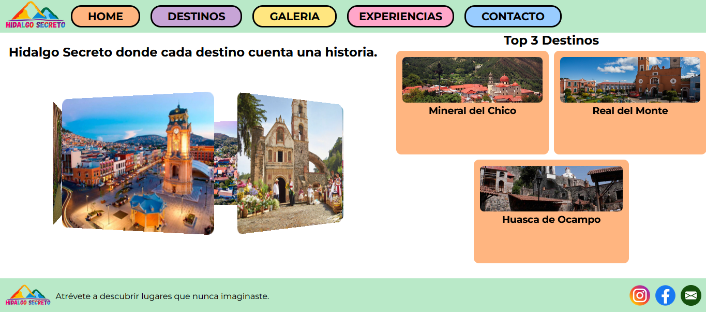

**MÓVIL**

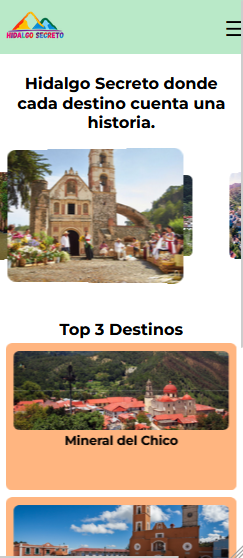

---

### Destinos

**WEB**

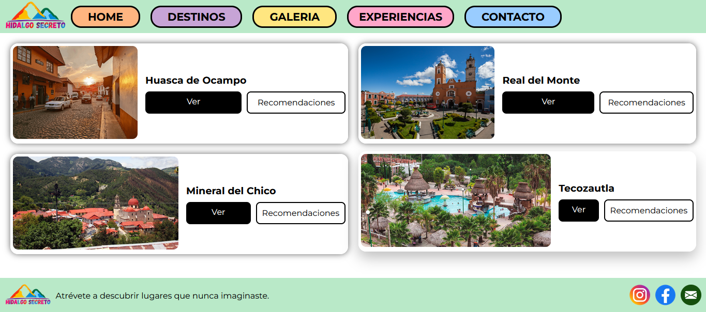

**MÓVIL**

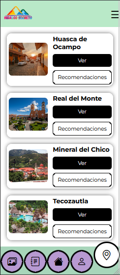

---

### Detalle

**WEB**

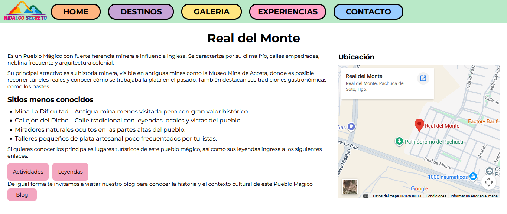

**MÓVIL**

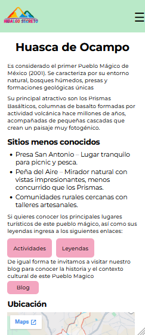

---

### Recomendaciones

**WEB**

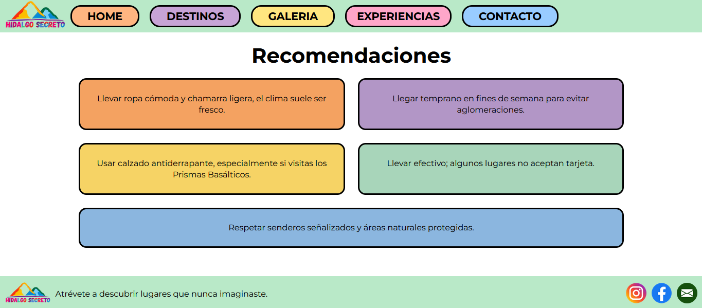

**MÓVIL**

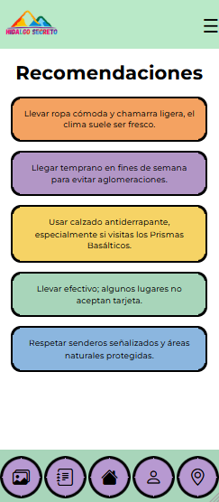

---

### Galería

**WEB**

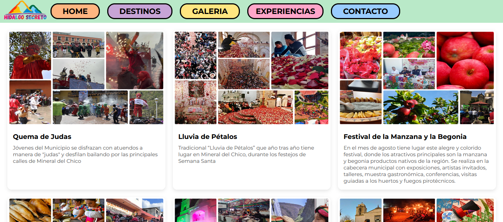

**MÓVIL**

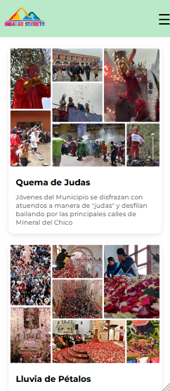

---

### Experiencias

**WEB**

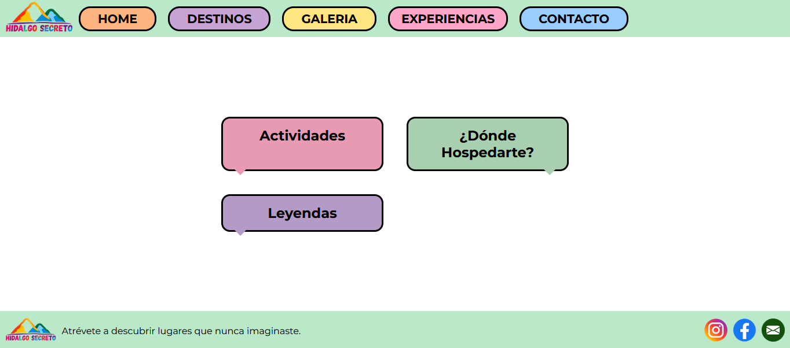

**MÓVIL**

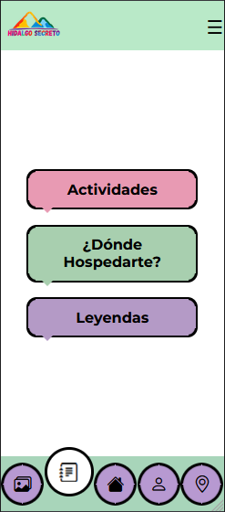

---

### Actividades

**WEB**

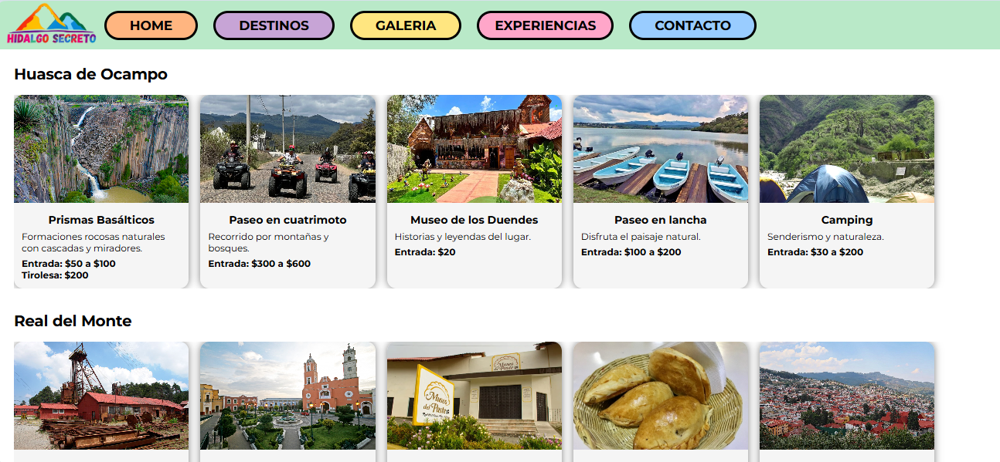

**MÓVIL**

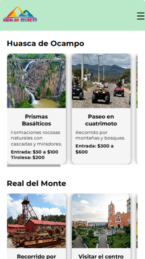

---

### Hospedaje

**WEB**

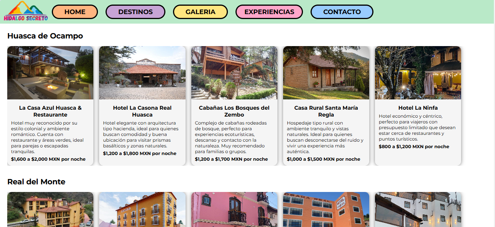

**MÓVIL**

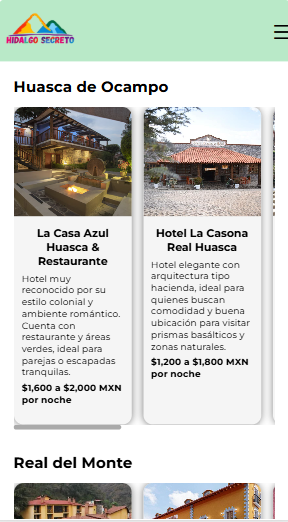

---

### Leyendas

**WEB**

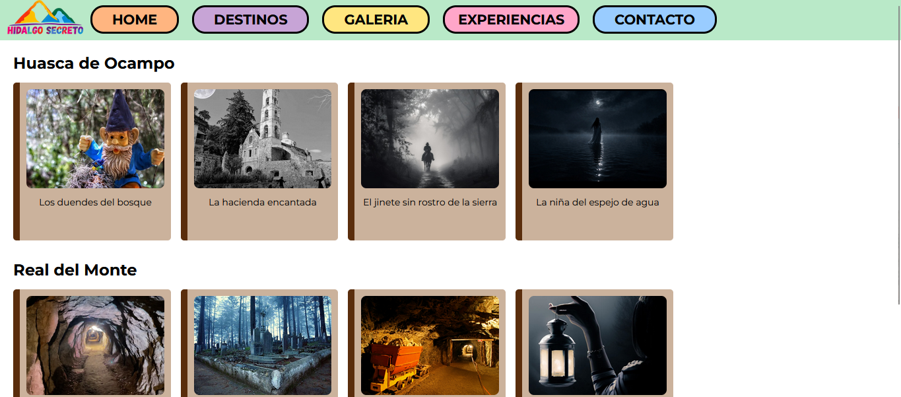

**MÓVIL**

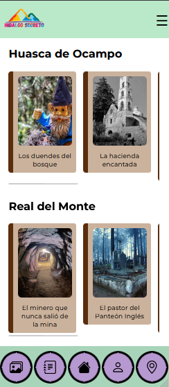

---

### Detalle de leyendas

**WEB**

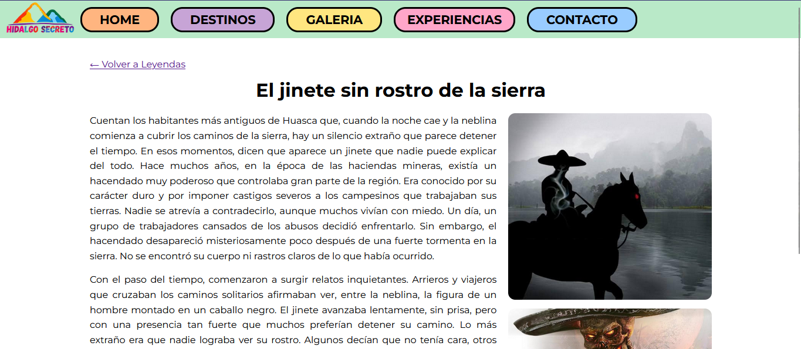

**MÓVIL**

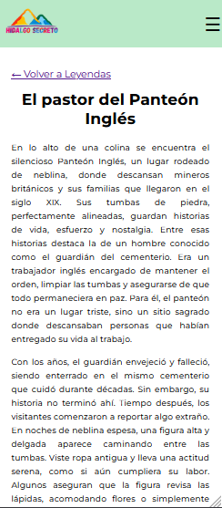

---

### Contacto

**WEB**

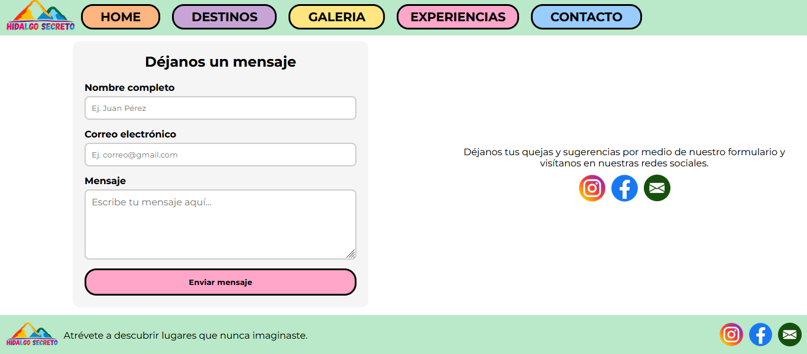

**MÓVIL**

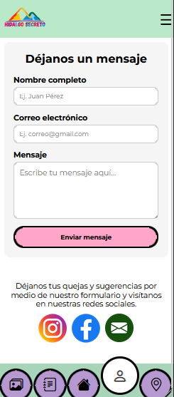

---

## 👩‍💻 Autor

Jennyfer Guadalupe Montes Romero
Desarrolladora Junior Fullstack

📫 Contacto: [jennyfermontes049@gmail.com](mailto:jennyfermontes049@gmail.com)

---
